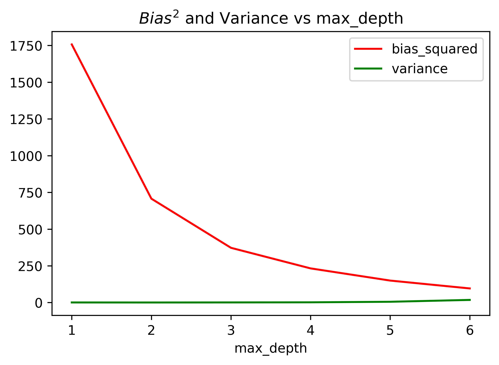
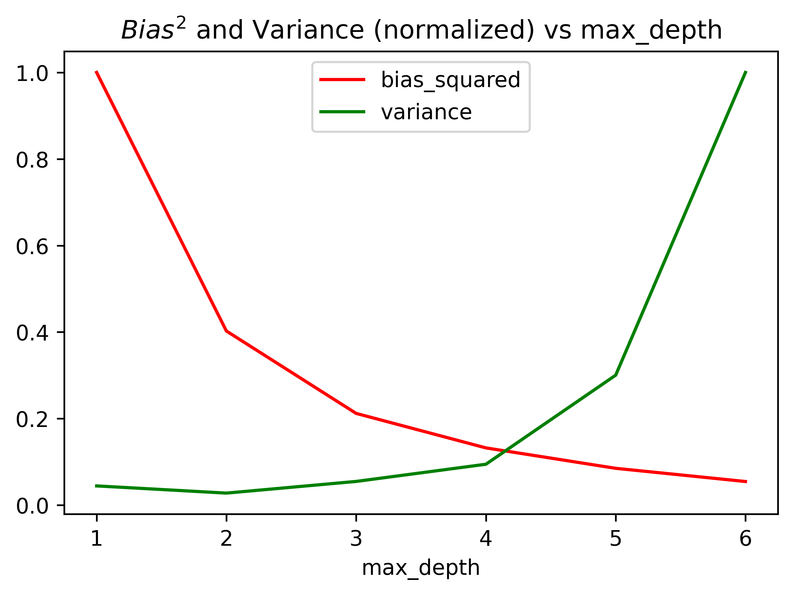

# Answer 1

If we don't do the train-test split, then the variance is also very high in the beginning. The same happens when we do train-test split but also shuffle the data. When the dataset is unshuffled, the test set is truly an unseen sample for the model, for which the formulae hold.

Below are the plots showing Bias Variance tradeoff for 5000 points in the dataset. The bootstrapping was done 200 times with separate test set sampling x in the range 10-11. In the second plot, each was normalized separately to understand their general trend with respect to the depth.

|Description|Images|
|----|-------------|
|$Bias^2$ and Variance vs depth||
|$Bias^2$ and Variance vs depth (each normalized separately to show the trend)||