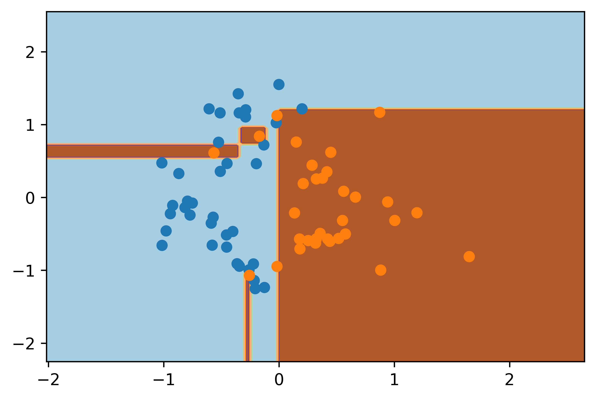
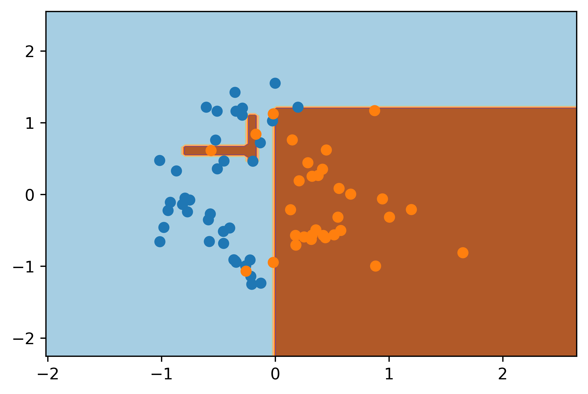
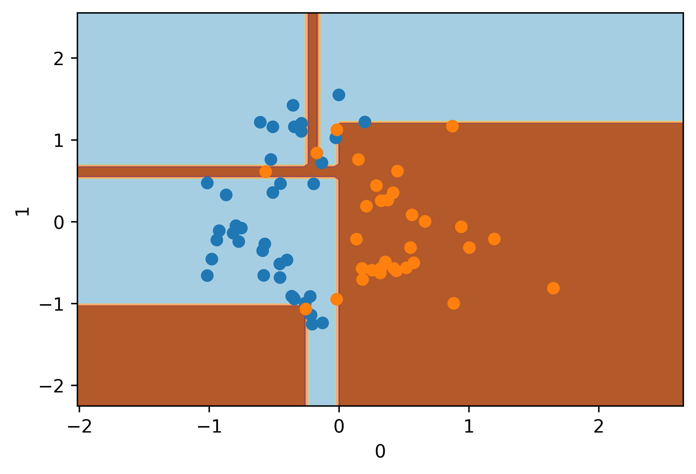
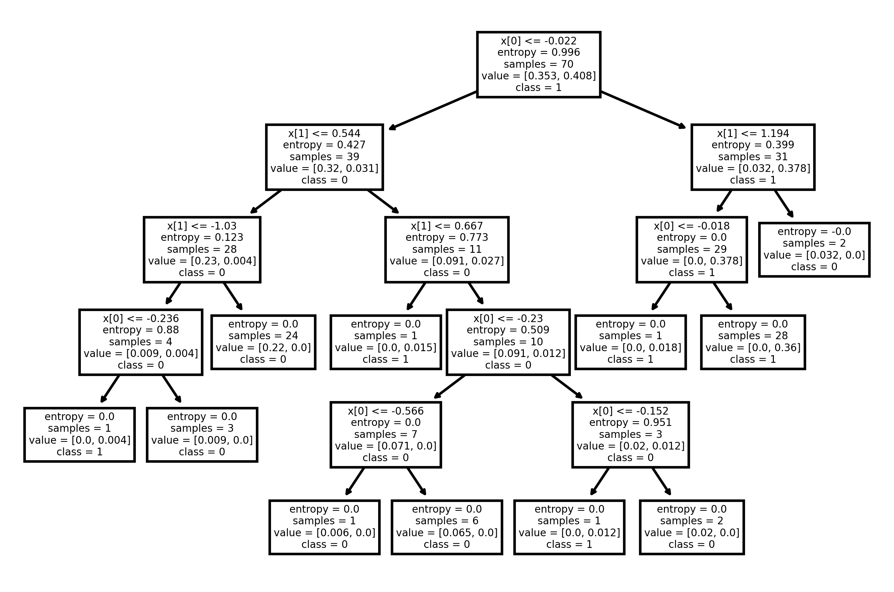
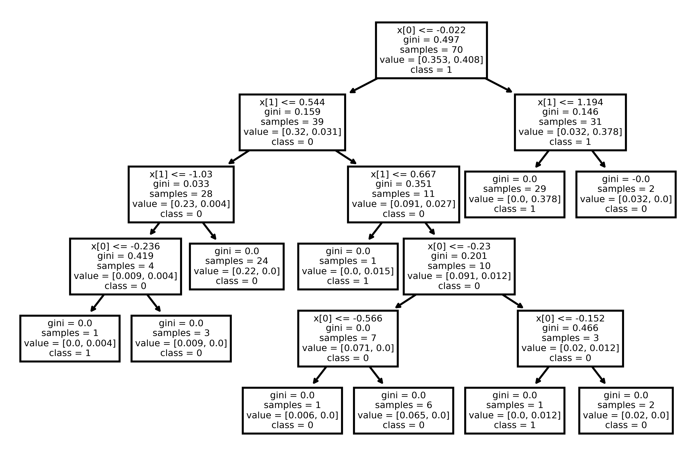

# Answer 2

## Running time for Weighted Decision Trees
### `fit()` time:

For the case of **real input discrete output** for unweighted samples, the running time is $\mathcal{O}(MN^2)$ for $N$ samples and $M$ features. Adding the weights does not change the running time as computing entropy and information gain still takes the same time.

### `predict()` time

The time complexity is still $\mathcal{O}(dN)$. Once a depth $d$ tree is made, we only need to make $d$ queries per datapoint, for a total of $N$ datapoints.

|Description|Images|
|----|-------------|
|Decision Surface of Implemented Weighted Decision Tree with Entropy Criteria||
|Decision Surface of Implemented Weighted Decision Tree with Gini Criteria||
|Decision Surface of sklearn Weighted Decision Tree with Entropy Criteria||
|Decision Surface of sklearn Weighted Decision Tree with Gini Criteria||
|sklearn Weighted Decision Tree with Entropy Criteria||
|sklearn Weighted Decision Tree with Gini Criteria||

