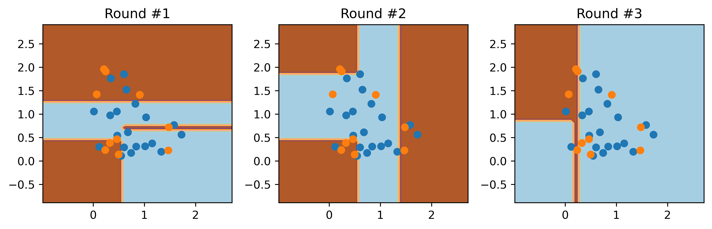
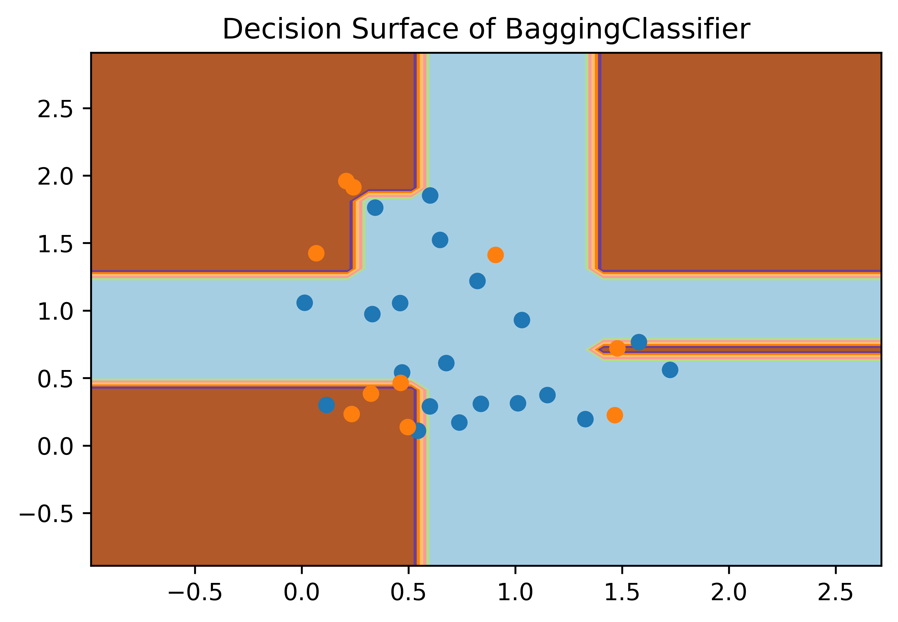
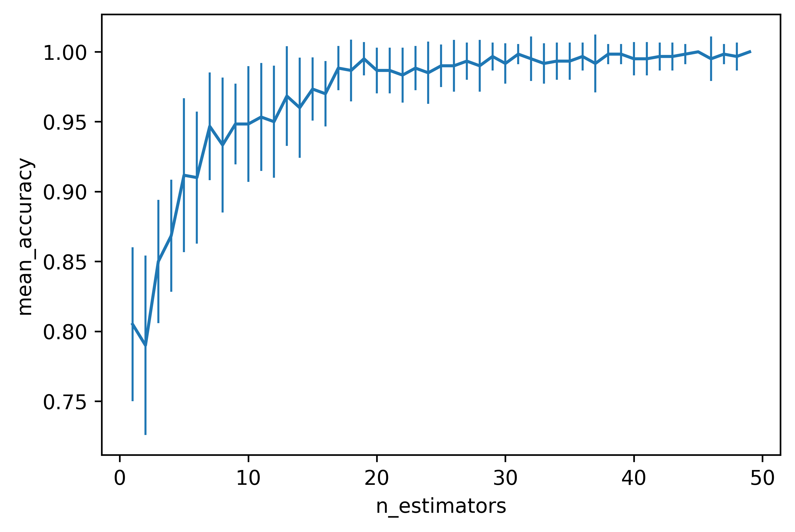
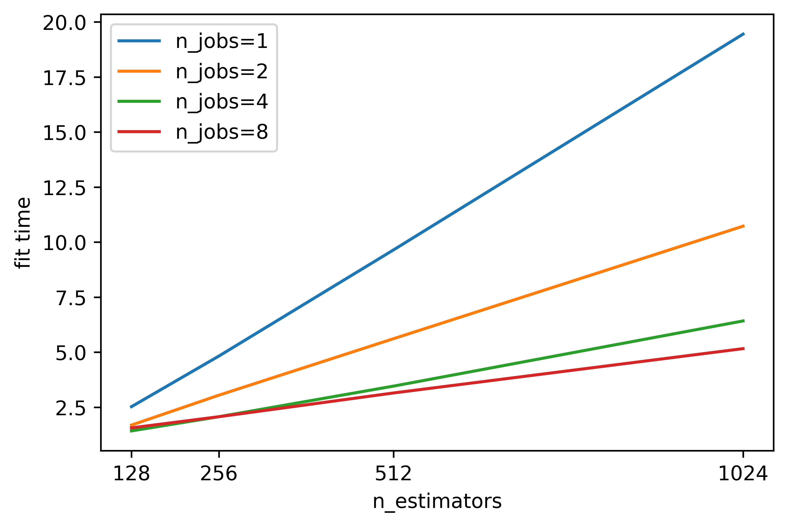
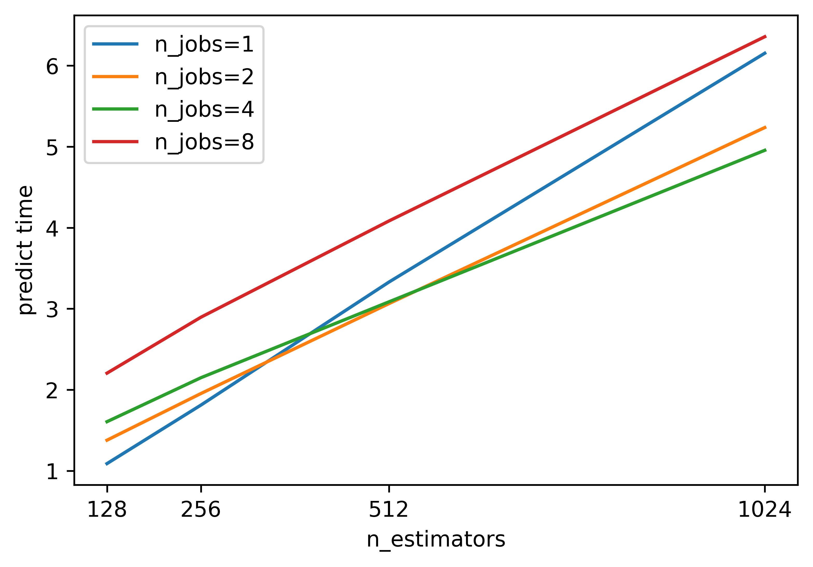

# Answer 4

We see that adding more processes has the biggest effect when n_estimators is large. When n_estimators is small, the overhead of setting up the parallel computation (creating multiprocessing pool and distributing the data to the processes) dominates. Prediction time in fact suffers as we add more processes for small n_estimators. We need to plot for a really huge number of n_estimators to see any benefit of parallel computation for prediction. The time complexity of fit is $\mathcal{O}(EMN^2\log N)$ and predict is $\mathcal{O}(EN\log N)$ for $E$ estimators.

|Description|Images|
|----|-------------|
|Decision surface for BaggingClassifier for each estimator(iteration)||
|Decision Surface of BaggingClassifier||
|Mean accuracy (and std) vs n_estimators (20 iterations)||
|Running time of fit for different n_jobs and n_estimators||
|Running time of predict for different n_jobs and n_estimators||

