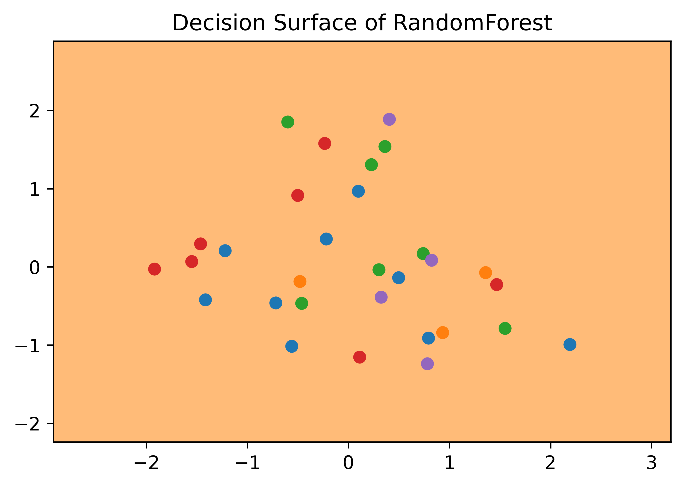

# Answer 5

## Running time
The time complexity of fit is $\mathcal{O}(E\sqrt{M}N^2\log N)$ and predict is $\mathcal{O}(EN\log N)$ for $E$ estimators.

Plots for the classification dataset in `random_forest_classification.py`
|Description|Images|
|----|-------------|
|Decision Trees of the RandomForestClassifier (using entropy)||
|Decision Surface for each Decision Trees of the RandomForestClassifier (using entropy)||
|Combined Decision Surfaces of the RandomForestClassifier (using entropy)||
|Decision Trees of the RandomForestClassifier (using gini)||
|Decision Surface for each Decision Trees of the RandomForestClassifier (using gini)||
|Combined Decision Surfaces of the RandomForestClassifier (using gini)||

Plots for the dataset in `q5_RandomForest.py`
|Description|Images|
|----|-------------|
|Decision Trees of the RandomForestClassifier (using entropy)||
|Decision Surface for each Decision Trees of the RandomForestClassifier (using entropy)||
|Combined Decision Surfaces of the RandomForestClassifier (using entropy)||
|Decision Trees of the RandomForestClassifier (using gini)||
|Decision Surface for each Decision Trees of the RandomForestClassifier (using gini)||
|Combined Decision Surfaces of the RandomForestClassifier (using gini)||
|Decision Trees of the RandomForestRegressor||
|Decision Surface for each Decision Trees of the RandomForestRegressor||
|Combined Decision Surfaces of the RandomForestRegressor||